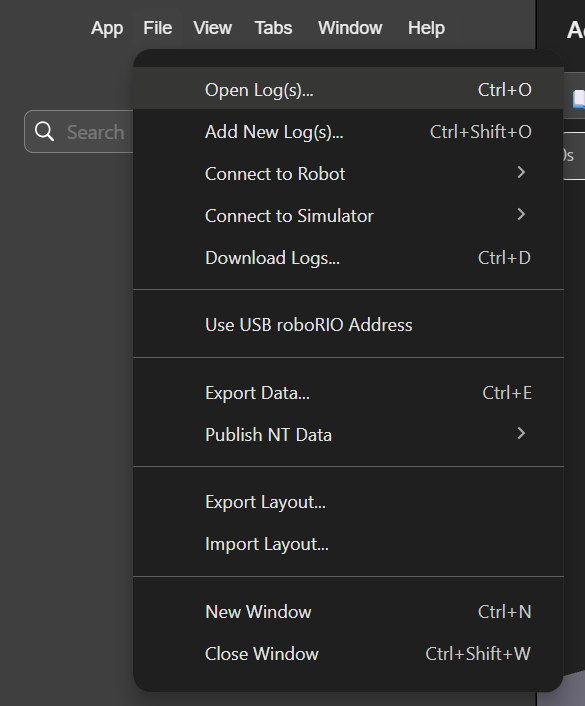

# Paragon Robot Template

## Overview
A season ready template equipped with swerve, vision, and logging.

## What's Included

Vendor Dependencies
- Advantage Kit
- CTRE-Phoenix (v6)
- PathplannerLib
- photonlib
- WPILib-New-Commands

Mechanical Advantage's TalonFX Swerve Template combined with their Vision Template:
- https://github.com/Mechanical-Advantage/AdvantageKit/tree/main/template_projects/sources/talonfx_swerve
- https://github.com/Mechanical-Advantage/AdvantageKit/tree/main/template_projects/sources/vision/src/main

Subsystems
- Drive — TalonFX swerve with a Pigeon2 gyro and an optional 250Hz odometry thread
- Vision — AprilTag pose estimation (Limelight on the robot, PhotonVision in sim)
- Intake — a minimal example mechanism
- LED — CANdle status lighting

## Requirements
Installation of the latest release of WPILib 2026: https://github.com/wpilibsuite/allwpilib

## Setup

### Applications
The following applications are required:
- Phoenix Tuner X (`TunerConstants.java` generation / motor testing)
  - https://v6.docs.ctr-electronics.com/en/stable/docs/tuner/index.html
- PathPlanner (Robot Pathing)
  - https://pathplanner.dev/home.html
- Elastic (Dashboard)
  - https://frc-elastic.gitbook.io/docs/getting-started/installation
- Advantage Scope (Replay)
  - https://docs.advantagescope.org/overview/installation
### Set Your Team Number
Ctrl + Shift + P -> WPILib: Set Team Number

## Building and Deploying
Ctrl + Shift + P -> `deploy`

### Simulation
The sim GUI and Driver Station open automatically. To replay a log instead of simulating
physics, change `Constants.simMode` from `Mode.SIM` to `Mode.REPLAY` — `currentMode`
picks `REAL` on its own whenever the code is running on a real roboRIO.

To simulate do either:
- Ctrl + Shift + P -> Simulate Robot Code
  - Then select either Sim GUI or Driver Station. Note that with Driver Station you must launch Driver Station to simulate the code.
- ./gradlew simulateJava

### Logs
Logs are written by AdvantageKit and open in AdvantageScope, which ships with WPILib.
On the robot they go to a USB drive if one is plugged into the roboRIO, otherwise to
internal storage. Every log is stamped with the git SHA, branch, and build date, so you
can always tell exactly which code produced it.

Generally, logs are held in a micro thumb drive, attached to the RoboRio. When a thumbdrive is attached to the RoboRio, the RoboRio dumps it's logs into the thumbdrive. Note, that each deploy, restarts the log file.

#### Viewing Logs
To view a log, take the thumbdrive and copy over the log file(s). Then to replay, open Advantage Scope:
- Click `File` in the top left.
- On the dropdown, open Log(s).
- 
## Project Structure

```
src/main/java/frc/robot/
├── Main.java                  Entry point. Don't edit.
├── Robot.java                 Lifecycle, AdvantageKit setup, scheduler.
├── Constants.java             Runtime mode (REAL/SIM/REPLAY) and global tuning values.
├── CanID.java                 A CAN ID, validated to the 6-bit range (0-63).
├── CanIDConstants.java        Every CAN ID on the robot. Update here when hardware changes.
├── PowerLogger.java           Per-subsystem current and power logging.
├── BuildConstants.java        Generated at build time. Don't edit.
│
├── commands/                  Command factories. Command bodies go here, never in bindings.
├── generated/                 Phoenix Tuner X output. Regenerate it, don't hand-edit.
├── robot_container/           Wiring only: subsystem construction, auto chooser, bindings.
├── subsystems/                One folder per mechanism. See "The IO Pattern".
│   ├── drive/                 Swerve modules, gyro, odometry thread.
│   ├── intake/                Example mechanism. Copy this shape for new ones.
│   ├── led/                   Status lighting.
│   └── vision/                AprilTag pose estimation.
└── util/                      Shared helpers that don't belong to one subsystem.

src/main/deploy/               Copied to the roboRIO at /home/lvuser/deploy.
└── pathplanner/               Paths and autos. Edit in the PathPlanner app.

vendordeps/                    Vendor library JSON. Update every season.
```

## Conventions

### The IO Pattern
A subsystem never touches hardware directly. It talks to an `IO` interface, and a
concrete implementation talks to the motors:

```
Intake.java          The logic. No motor calls anywhere in it.
IntakeIO.java        The interface, plus an @AutoLog inputs class.
IntakeIOTalonFX.java The real hardware.
IntakeIO() {}        An empty implementation, used for sim and replay.
```

This is what makes log replay work. AdvantageKit records everything crossing the IO
boundary, so a log can be re-run later through the exact same logic with the hardware
swapped out — you can debug a match from your laptop, days afterward.

The rule that keeps it working: **inputs come from the IO layer, nowhere else.** A
sensor read hidden inside subsystem logic isn't logged, so replay silently diverges from
what really happened.

**NOTE: The IO layer is meant for all hardware not just a motor.** So say you have a specific motor and sensor implementation, then you would implement IntakeIOTalonFXTOF. TOF stands for TimeOfFlight Sensor.

See for more information: https://docs.advantagekit.org/data-flow/recording-inputs/io-interfaces

Subsystems needing to apply outputs after the command scheduler has run extend
`FullSubsystem` instead of `SubsystemBase` and override `periodicAfterScheduler()`.

### Commands
Command bodies belong in `commands/` as static factories, not inline at the binding
site. A binding list should read as a table of button-to-action, and a command written
inline can only ever be used by that one button.

### Bindings
`Bindings` maps controller buttons and button combinations to commands. One instance per
controller.

**Declare, then build.** `bind()` only queues a binding; nothing reaches the scheduler
until `build()` runs. This is deliberate — detecting that one combination overlaps
another requires knowing all of them first.

**`build()` is mandatory.** Forget it and every binding on that controller silently does
nothing. There is no error.

When a button combination is found in another button combination, the smaller combination is given the debounce to prevent accidental actions. The debounce prevents a combination from triggering a command until a set amount of time is over. The remaining buttons on the larger combination are also negated from the smaller combination to cancel the trigger before the debounce ends.

**Human input only.** Sensor-driven triggers — "rumble when the intake has a game
piece" — are not bindings and belong elsewhere. Preconditions on a command
(`onlyIf`, `onlyWhile`) belong on the command, so they still apply in autonomous.

### FullSubsystem
The FullSubsystem is the same as a subsystem but has an extra periodic function called, `periodicAfterScheduler()`. Which means after the scheduler, meaning, after the periodics and the commands, `periodicAfterScheduler()` is called. This can be useful for logging, such as Power Logging.

To use the FullSubsystem, just extend it by a class and implement `periodicAfterScheduler()`. In order for `periodicAfterScheduler()` to work, an instance of the class must exist as `periodicAfterScheduler()` is a non-static method.

### Logging
Generally, logging is done by littletonrobotics's Logger class. There are two types of logs:
- Input Logs
  - Input logs are logs that cannot be calculated, such as sensor data from the real world. Which is why in IO file implementations inputs grabs temperature, angular velocity, position, and etc.
- Output Logs
  - Output logs are logs that can be calculated, such as position goals or calculating power.

A question to ask yourself is, can you simulate this from other inputs?
- Yes -> Output
- No -> Input

See more about input and output logs here:
- https://docs.advantagekit.org/data-flow/recording-inputs/io-interfaces
- https://docs.advantagekit.org/data-flow/recording-outputs/

#### How to Log
##### Logging Inputs
To log inputs, you should follow Mechanical Advantage's IO Pattern.
https://docs.advantagekit.org/data-flow/recording-inputs/io-interfaces
##### Logging Outputs
To log outputs, use `Logger.recordOutput()`
##### Directories
Depending if you use input or output logging, the root path will be either `~MyInputs` or `~MyOutputs`. Mechanical Advantage already prepackages a lot of logging that makes it harder to recognize which files are yours. By using `/` will make a folder.
### Power Logger
Power Logger logs power and current from hardware, subsystems, and the total. For Power Logger to log, the method `periodicAfterScheduler()` must be called after the scheduler in `Robot.java`. Since PowerLogger extends FullSubsystem, it offers `periodicAfterScheduler()`, thus, the method is already periodically called after the scheduler.

To log the power consumption of a subsystem, it's as simple as adding `PowerLogger.addSubsystem()` and filling out the subsystem's name and all of the hardware/devices that offer its current value as a double supplier in **Amps**.

## Starting a New Season

### Adding a Subsystem
Copy the shape of `subsystems/intake/`:

1. Create `subsystems/<name>/` with `Name.java`, `NameIO.java`, and `NameIOTalonFX.java`.
2. Add the CAN IDs to `CanIDConstants`.
3. Instantiate it in **all three** branches of the switch in `RobotContainer` — `REAL`
   gets the hardware IO, `SIM` and the default get `new NameIO() {}`.
4. Once the subsystem is established, all hardware that can measure current draw should be logged via: `PowerLogger.addSubsystem()`

### Updating the Drivetrain
Regenerate `generated/TunerConstants.java` from Phoenix Tuner X.

### Updating CAN IDs
All of them live in `CanIDConstants`. Nothing else should hardcode an ID.

### Updating Vendordeps
Vendor libraries are year-specific and will not work across seasons. Update every JSON in
`vendordeps/` at the start of a new year, then rebuild before changing anything else, so
a vendor break isn't tangled up with your own changes.

## Troubleshooting

**If a controller does nothing**, check if `build()` is called on that `Bindings`
instance after the last `bind()`.
