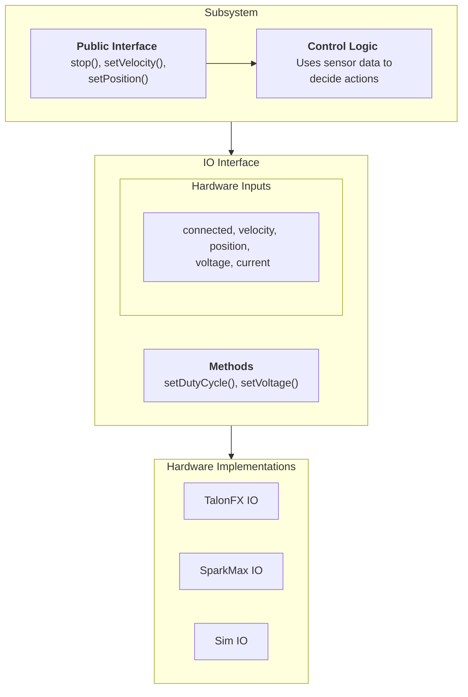

Original Source: https://docs.advantagekit.org/data-flow/recording-inputs/io-interfaces
  This was modified for my understanding.

# IO Structure

<b>Subsystem</b>:
  - Public Interface:
    - Public Interfaces are actions. Actions can be setting velocity, position, etc.
  - Control Logic:
    - Helps actions decide what actions to do. For example: based on range sensor data will decide how much velocity is needed to be set for the motor.

<b>IO (Input/Output)</b>:
  - Hardware Interface:
    - Hardware Inputs
    - The interface has the general methods and inputs that typical hardware will have. For example, if I were to make a simple hardware interface: for its inputs it would have variables such as, `connected`, `velocity`, `position`, `voltage`, `current`, etc. Then for methods it would have `setDutyCycle` and `setVoltage`.

<b>The purpose</b>:
- Allows for accurate logging
- Replace a motor with a different motor won't require major code changes, only changing the IO.
  - Essentially, if we have to use a different motor and we created a specific IO Implemenation for that case, then all you have to do is change the IO object.
    - For example, if I had a subsystem `Intake`, it will take in `IntakeIO` or a generic motor like `MotorClosedLoopVelocityIO`. Assuming we take in a generic motor interface, then anything that implements `MotorClosedLoopVelocityIO` can be used as the motor that the subsystem can use. This allows for swappable motors. So say we are using a TalonFX Motor and we replaced with a SparkMax from REV, then instead of completely overhauling the subsystem, we change the IO object passed in. Since that object is an interface of `MotorClosedLoopVelocityIO`, the subsystem will remain unchanged and act just as if we were using a TalonFX Motor.

<b>My Structure</b>:
- What I've described above is essentially the code structure I'm using.
- Some slight differences, comparing their IO examples is that I'm making generic motor class which then can be extended to be customized for its own configurations.
